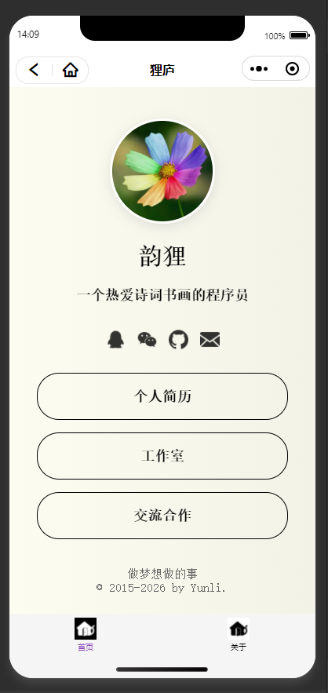

# README

## 介绍

仿 linktr.ee 的链接聚合页面。

> 其他语言版本在 /language/ 文件夹下'

## 特性

1. 纯静态，无数据库，无需安装依赖项，开箱即用
2. 完全开源，可自主定制，但需保留作者署名

## 使用方法

1. 将本项目 clone 到本地；
2. 修改相关文件和图片；
3. 部署。

## 运行预览

1. **onelink**  

2. **onelink-config**  

3. **onelink-wx-applet**  

4. **onelink-nodejs**  

